# API Dashboard

The API Dashboard guide offers a concise overview of the user journey, from enrolling in a plan to utilizing the different APIs on offer.

#### Subscribe to Devnagri API Services

Click on the Subscribe API button in the API Services tile to subscribe.

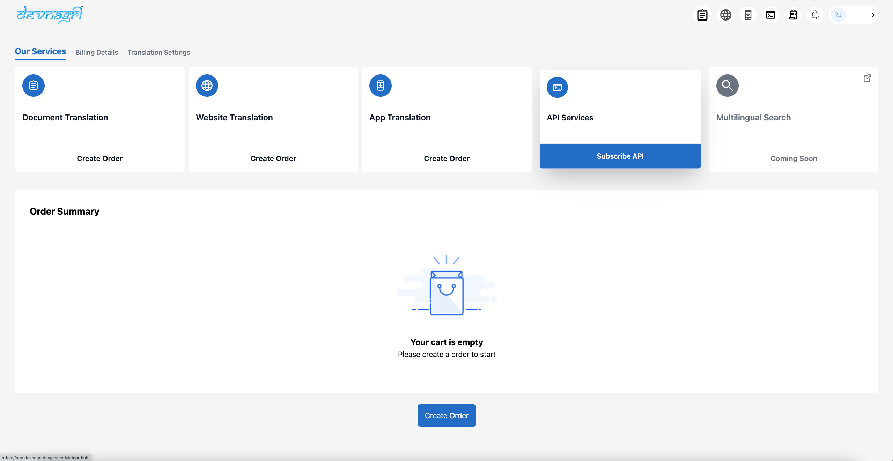

Select the specific API depending on the requirements from the API Hub section.

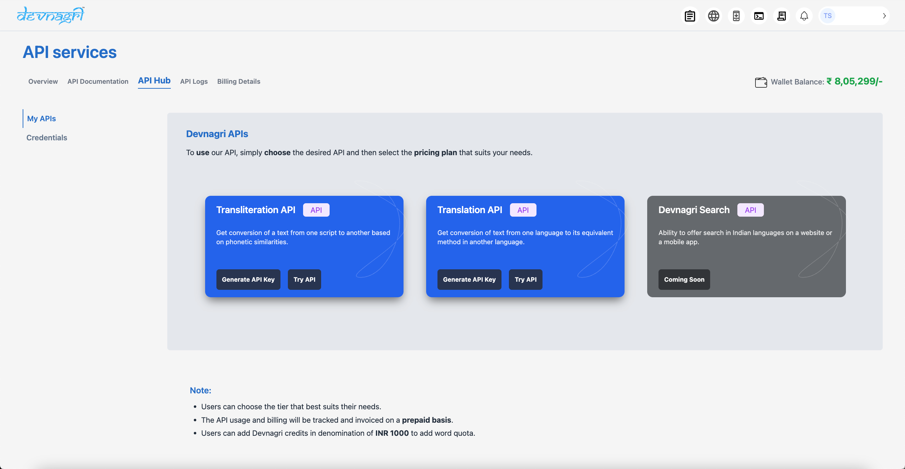

Choose one of the plans as per requirement.

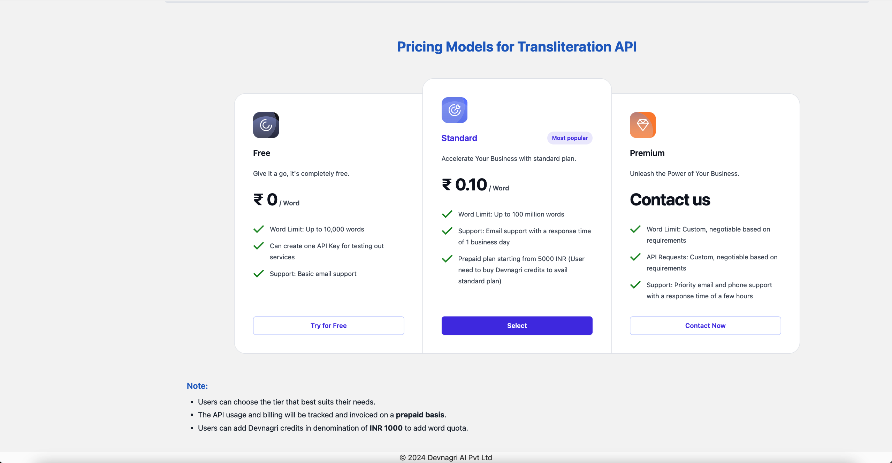

#### Plans and their details:

1. Free Plan : Word limit of 10,000 words and restriction of being able to create only a single project key for API usage.

2. Standard Plan : Charged at ₹ 0.10/word with option to generate multiple project keys for APIs.

Note: Minimum balance of ₹ 1000/- needed to make API requests.

3. Premium Plan : Primarily catering to Enterprise customers with customised quotes based on specific requirements. Plus, a dedicated account manager during the integration phase.

Post plan selection, the user will get redirected to a page to help in creation of API credentials.

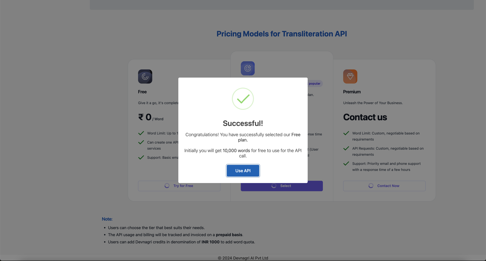

#### Creation of API credentials

API key can be generated by clicking on the Create button and do remember to mention the project name.

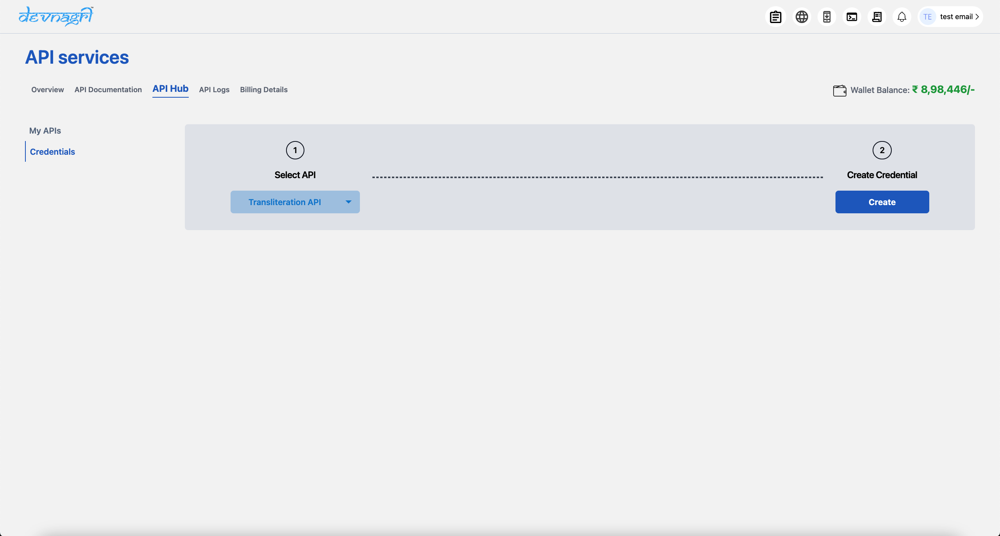
 

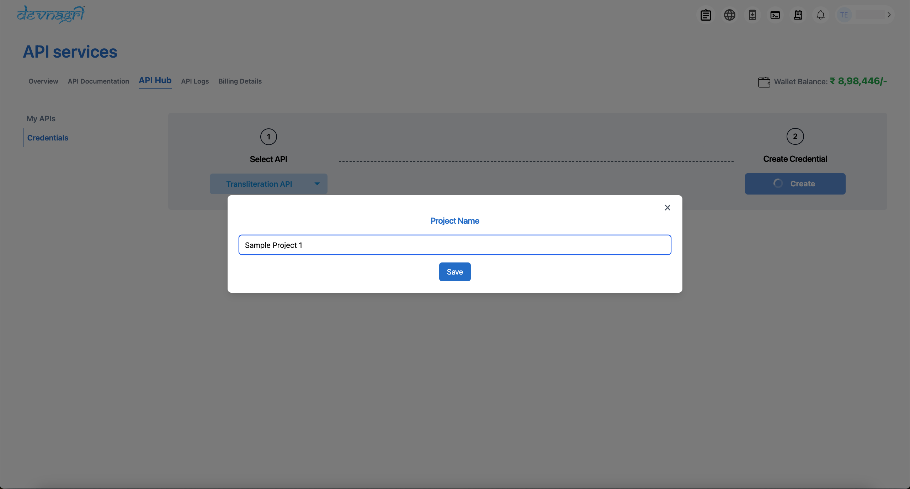

Post Save, the API key will be displayed as partially hidden on the screen. However, the complete key gets copied using the copy button.

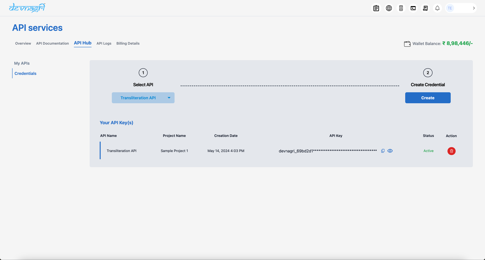

Post the credentials, the user can move to API documentation to get the API curl requests and explore other options in the API requests.

#### API Documentation

Select the API and choose amongst the API keys as per the project.

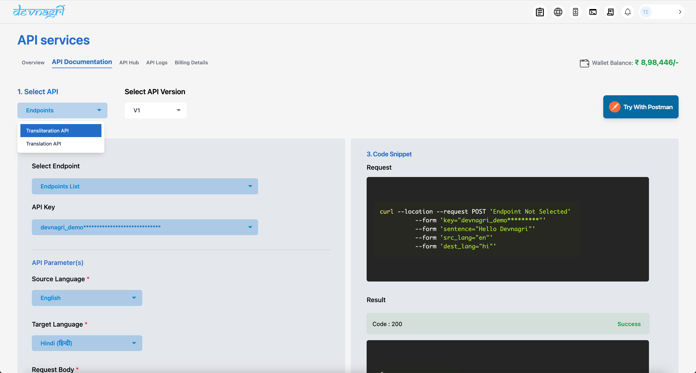

Select the API key and choose the Source and Target Language from the dropdowns highlighted below.

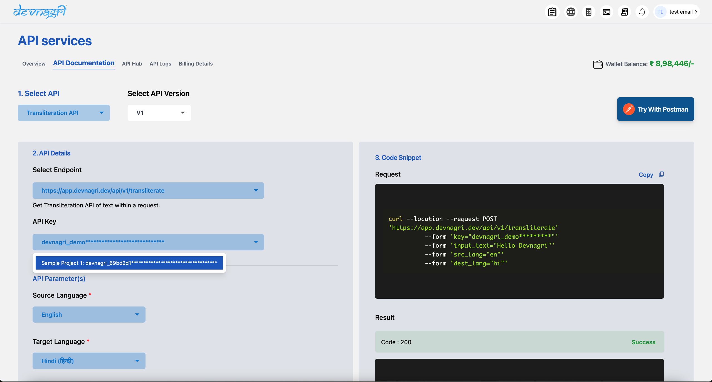

To help ease the API integration, the API curl request and sample response are displayed on the right side of the page.

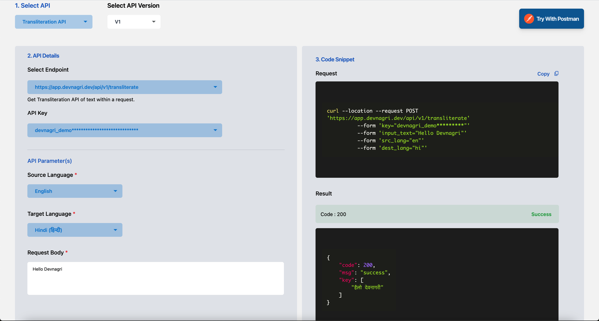

#### Overview

Check the API request stats on the Overview page to see the number of API calls made and the number of words consumed.

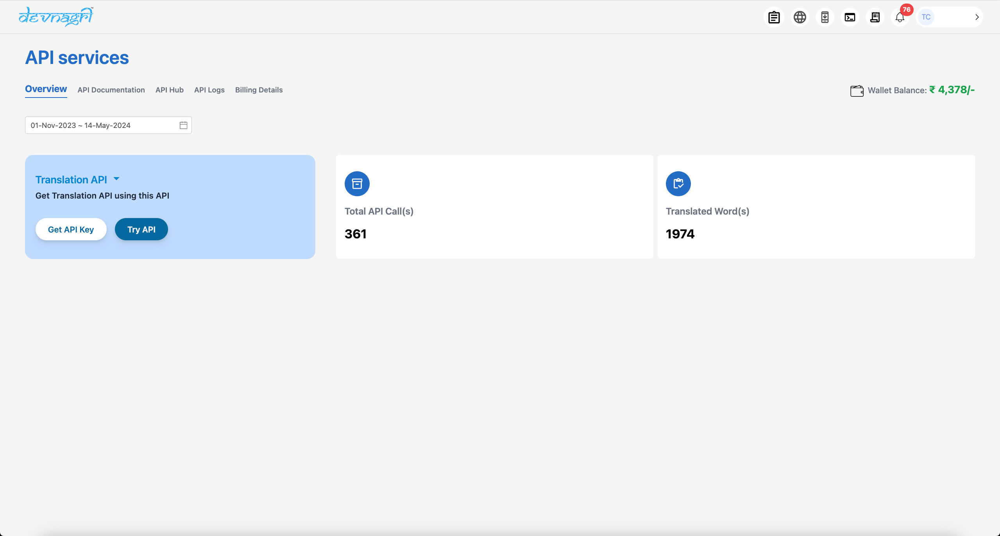

#### API Logs

For detailed logs including filters on API type, Date Range to help in better, detailed analytics at customer end.

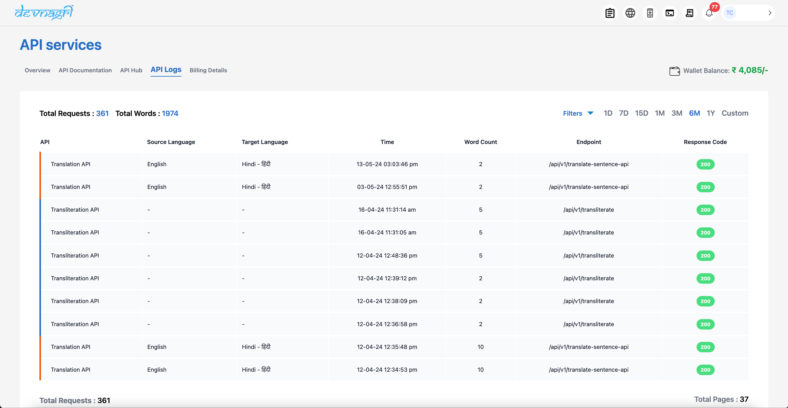

