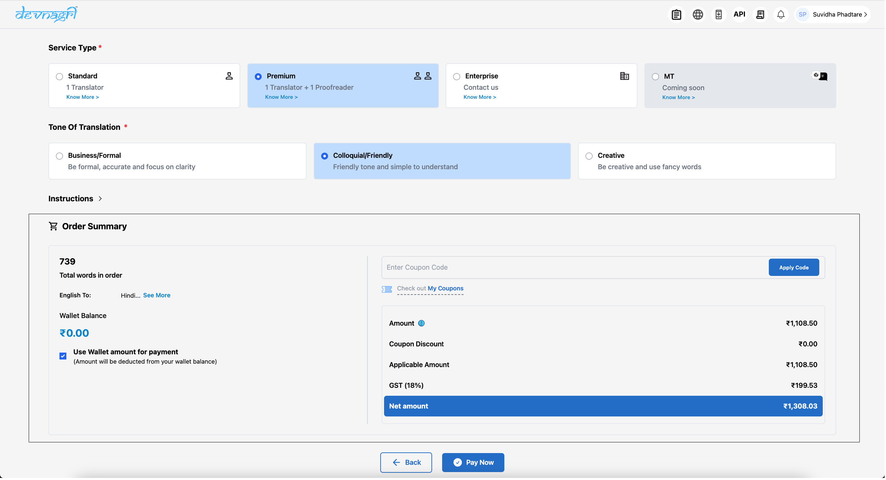
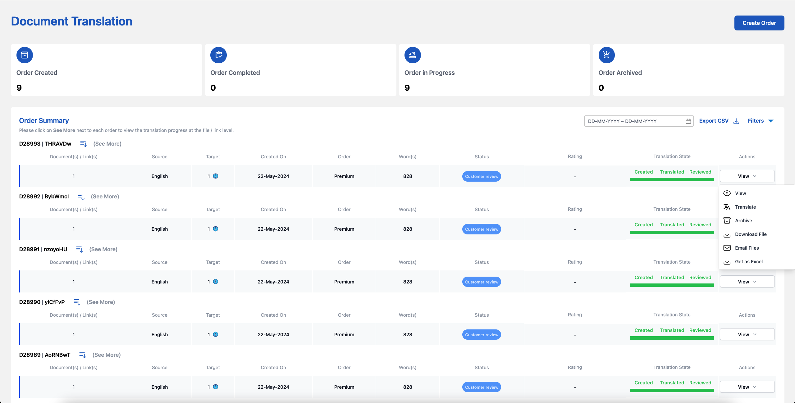
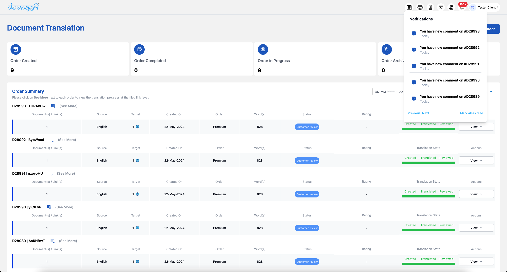
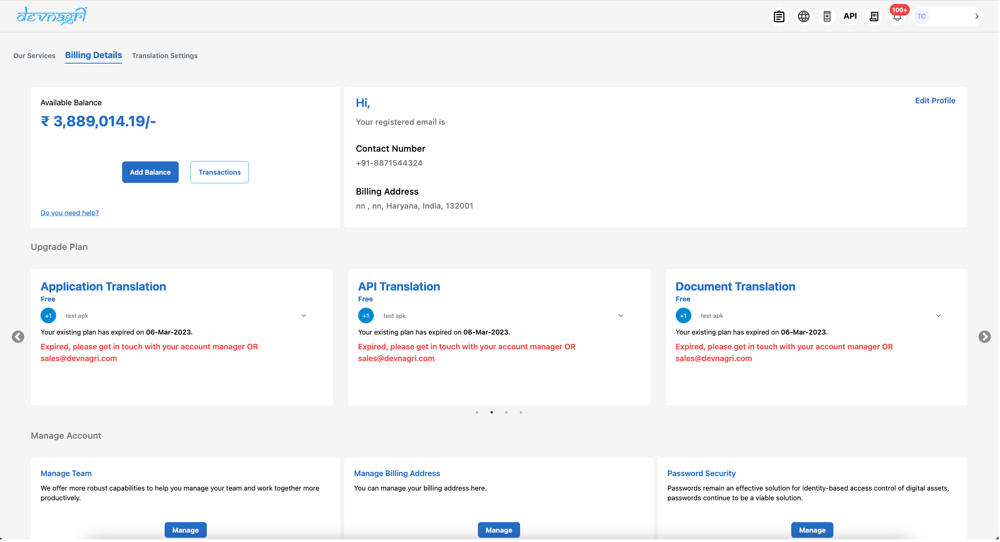
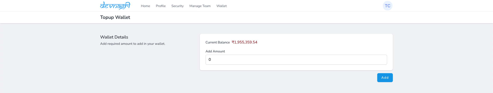

# Purpose

The user guide provides brief description about :

1. Devnagri

2. User Dashboard

3. Glossary

4. DOTA Web

5. DOTA Mobile App

# Devnagri

Devnagri is India's first AI-powered translation platform to help customers communicate to their endusers in the language they understand. This manual will help in understanding the functionalities of the system. You may follow these steps to place a translation order.

## Getting Started With Devnagri

On the homepage of the [Devangri](https://devnagri.com/) there is an option of “Order Translation”. By clicking on the option user will be redirected to the Login page.

### NOTE: User need to sign-up/sign-in before Placing an order

On the login page, user has the option to [register](https://account.devnagri.com/register) by submitting the necessary information (including Name, Company, Industry, Email ID, Mobile Number, and Password) in the registration form.

Once the complete details are filled, click on the “Register” button, a verification email will be sent on the registered email.

After clicking the "Register" button, the user will be logged in and directed to the following screen.

To complete the registration process, please click the "Verify Email Address" button.

Once the registration process is completed, you will be automatically redirected to the user dashboard screen.

<!--To create a Document Translation order, one needs to click on the Create Order Button on the Document Order tile -->

<!---->

<!--After that user needs to fill in billing details.-->

<!---->

<!---->

<!--Once Billing details are updated, user can now proceed to create an order.-->

<!---->

### Logging In

1. User can [login](https://account.devnagri.com/login) to Devnagri by using credentials (Email ID & password) that were set during the registration process.

2. User can also login using “Magic Link” option, the user needs to enter the registered email address in the text box and an autologin link will be sent on the registered email address.

### Password Recovery

If a user has forgotten (or wants to reset) the password, then using [“Forgot Password”](https://account.devnagri.com/forgot-password) option given on login screen it can be reset. Enter the registered Email ID, a reset password link will be sent over email. Click on that link and enter new password. User will be notified on the successful update of the password.

#### Create Document Translation Order

To create a Document Translation order, one needs to click on the Create Order Button on the Document Order tile.

Once Billing details are updated, user can proceed to create an order.

#### Enter Project Name

Choose a relevant project name for the document translation order. This can relate to company, date, or any other name which the user could remember in future.

#### Select Target Languages

There will be a list of languages available for translation. User can select more than one language and can get translation in multiple languages in a single order. User will be given the choice where Source Language will be English and target language can be multiple.

#### Select Industry

User needs to select the industry to which the content is related. It helps Devnagri AI to assist better in the translation process. Also industry wise glossary feature is available in Devnagri which depends on this selection.

#### Upload Files To Translate

User has the choice to either select or drop files. Multiple files (Upto 10 files with maximum file size of 15MB each) can be uploaded in different formats. We accept 11 different file formats (.json, .xml, .csv, .docx, .srt, .pptx, .txt, .pdf, .xlsx, .idml, .html).

#### After the upload process is finished, you can click the "Next" button to provide additional details on the following screen.

#### Service Type

Choose the translation service pricing package according to the requirement. There are different packages according to the service provided.
#### Standard Translation Service - User will get certified translators from the chosen industry. The accuracy rate will be around 70-80%.
#### Premium Translation Service - User will get certified translators and reviewers from the chosen industry. The accuracy rate will be upwards of 95%.

#### Tone of Translation

Choose the translation tone that best suits your target audience and aligns with the company communication strategy.

#### Instruction

This section contains additional information about the order. Users should include all specific instructions and details here.

### Order Summary

At the bottom of the order page, you will find the Order Summary. This section displays details such as word count, language, and total payable amount.

#### Total Words

The total number of words will be shown after calculation from the uploaded files.

#### Amount

The total order amount including taxes. 

#### Wallet Balance

It shows available wallet balance in user account. 

#### English To

This section displays the list of target languages chosen for translation. Users can verify whether all the desired languages have been selected.

#### Apply Coupon

Users can apply any available offer coupons here, which will provide a discount on the billing amount basis the code. 

#### Total Amount

The actual billable amount after applying any coupon is shown for final billing. User can select the option to “Pay Now” and can make the payment with internal credits or online through the payment gateway.

### Payment

User will be redirected to the payment gateway upon clicking on Pay Now, where the amount for the order can be paid using various methods such as Scan QR with Paytm, netbanking, debit card, credit card etc.

### Adding Glossary

This works in two ways, user can either add the words manually or can add a file with all the words to be added in glossary. The glossary at Devnagri is updated on the industry basis, it automatically gets embedded in all the orders from the same industry background of the user. On the navigation panel user will find the “Order” menu, select it, go to the “Glossary” tab. In “Add Glossary” option the user can choose between Manual &  Upload.

### Manual Glossary

i. Add the “Industry”, select according to the order and terminology

ii. Select "Source language"

iii. Select "Target language"

iv. “Term” add the term/word

v.“Description” is used to add details for the term added. It helps if the translation is required but in a specialized way,

vi.“Translate Term” Select or Deselect; on selecting the option terminology will be translated according to the given instructions & on deselecting the word will remain untranslated.

vii. Use “Save” option to store the terms in glossary.

### Upload Glossary

i. To understand how to upload the terms in bulk user can “Download Sample File”. Add the term, description, and the status of translation in “Yes/No”

ii. After the information is added in the file and saved, choose the “Industry”.

iii. Select "Source Language"

iv. Upload the file by simple “drag and drop” or selecting the local file destination.

v. As soon as the file gets successfully uploaded select “Save” option.

### Order Status

To check the order status user needs to click on the order button in the navidation bar. On the landing page the order listing will be available with all the details. The “Status” column shows the current status of the order. The different options can be:

1. Processing:
This order is being processed.

2. Unassigned:
This status indicates that translators are yet to be assigned for the order.

3. Not Paid:
In case of transaction failure or unpaid order this status is shown. User can pay by selecting option from “Action” tab.

4. Assigned:
Once the translator is assigned the project status becomes “Assigned”

5. Pending Review:
If the user chose the option to get the review along with translation then “Pending Review” comes after the completion of translation.

6. Customer Review:
Customer has to check and confirm the order once it is done from our end. Till then the order is in "Customer Review" state.

7. Completed:
After the customer marks the order as completed the status is changed to “Completed”

8. Archived:
User can archive the order if it's no longer required to be shown in the list of active orders. User can use option from “Actions” tab

### Actions

For the project statuses shown there are different actions that user can take, these are:
1. View: 
To check the order details, file-wise and language-wise word counts and the bifurcations of the translation type of each segment.

2. Translate:
To check the current progress of translation, user can choose the option of translate. User can also review the translation and accept the work by using this option.

3. Archive:
User can archive any project using this option. The archived project will be removed from translation process but will be available in the user dashboard.

4. Download File:
User can download all the files of the order with translated content using this option. The files will in the same format as the original uploaded file.

5. Email Files:
User can get all the files of the order with translated content on their registered Email address using this option. The files will in the same format as the original uploaded file.

6. Get as Excel:
User can download all the files of the order with translated content using this option. The files will be available in the xlsx format with source text in one column and its corresponding translations in the other column.

5. Pay:
This option can be used to pay for unpaid orders. It will not be shown for paid orders.

## User Dashboard

User dashboard holds all the information about the number of projects ordered, translation status, profile, bill etc.

### Navigation Panel

The various options under Navigation panel are;

#### Profile

Top-right corner has a profile section that shows the customer's name and registered email address below which there are:

1. Account Settings:
It holds different sections to update the personal profile of the customer.

2. Billing Details:
Information such as Billing Address, GSTIN are stored here.

#### Notifications

This tab shall blink whenever any new event happens with the project. For example, when the translator submits the project for review.

#### Orders

Using this menu user can check out all the orders (current and previous) along with payment status.

#### Transactions

It holds information about all the transactions made by user.

### Customer Dashboard

#### Add Picture

User can add a profile photo for display purpose using this option. 

#### Translation Credits

This is a premium service, pre-paid wallet that can be used by the customer to pay for any premoum translation orders.

#### Buy Credits

Using Add Balance option, a customer will be able to buy [Translation Credit](#TC) credits in the account.

