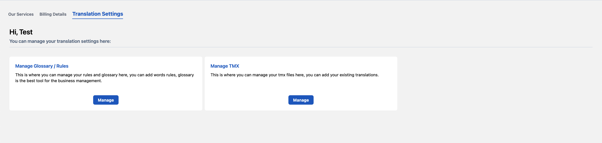

# Rules / Glossary

Glossaries are the definitions and meanings of sentences which are unique to your domain. Glossaries will help translators to apply correct and ensure consistent translations. This will eventually improve the translation speed & quality.

Rule is implementation of prefrential translation of specific set of words using Machine Translation as well as Translators.

## Types of Glossaries / Rules

1. Translate Term
2. Do not translate

## Translate Term

Mention the translated term which will replace the input or source term.

## Do not Translate

This ensures that the input term remains as is and is not translated.

## How to Add Glossary / Rule

### Step 1: Go to Translation Settings Tab

### 

### Step 2: Click on Manage Glossary / Rules

### 

### Step 3: Click on Add Glossary

### Add Term

i. Select the “Industry”, according to the order and terminology.

ii. Select "Source language".

iii. Select "Target language".

iv. “Input Term” - Enter the term/word to be translated.

v. "Replaced Term" is the output / preferential translation for the "input term". 

vi. User can select "Apply as Rule" to ensure that the preferential translation is mandatorily chosen for the input term.

vii. User can select "Case Sensitive" option to consider the distinction between uppercase and lowercase letters when processing rules.

viii. Use “Save” option to store the terms in glossary.

### Upload Glossary

i. Preferably use this option incase there is a need to upload glossaries in bulk. Add term, description, and the status of translation in “True/False”

ii. After the information is added in the file and saved, choose the “Industry”.

iii. Select "Source Language"

iv. Select "Target Language"

iv. Upload the file by either using “drag and drop” or selecting the local file destination.

v. User can select "Apply as Rule" to implement prefrential translation for specific set of words using Machine Translation as well as Translators.

vi. User can select "Case Sensitive" option to consider the distinction between uppercase and lowercase letters when processing rules.

vii. As soon as the file gets successfully uploaded, select “Save” option.

## How to Generate Glossary

### Step 1: Go to Translation Settings Tab

### 

### Step 2: Click on Manage Glossary / Rules

### 

### Step 3: Click on Add Glossary

i. Choose relevant “Industry”.

ii. Select "Source language".

iii. Select "Target language'. User can select multiple target languages.

v. In order to add the content for creating glossary user can upload file or can choose an existing order.

vi. Use "Generate" option to generate glossary

