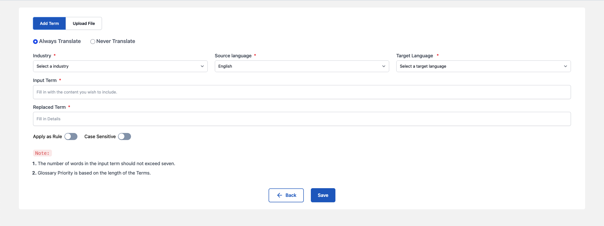
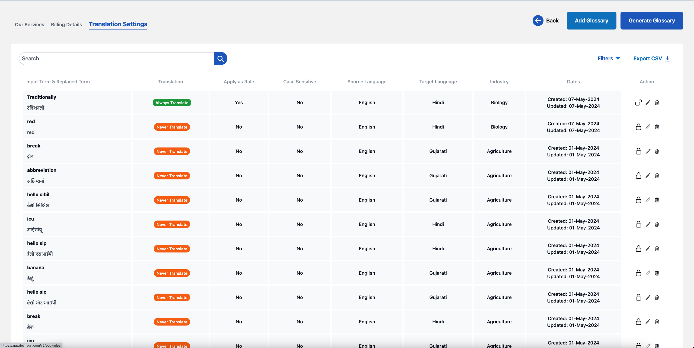

# Rules / Glossary

Glossaries are the definitions and meanings of sentences which are unique to your domain. Glossaries will help translators to apply correct translations as per customer needs and thus ensure consistency in translations. This will eventually help improve the translation speed & quality.

Rule is mandatory implementation of prefrential translation of specific set of words while using Machine OR Manual Translation.

## Types of Glossaries / Rules

1. Translate Term
2. Do not Translate

## Translate Term

Mention the translated term which will replace the input or source term.

## Do not Translate

This ensures that the input term remains as is and is not translated.

## How to Add Glossary / Rule

### Step 1: Go to Translation Settings Tab

### 

### Step 2: Click on Manage Glossary / Rules

### 

### Step 3: Click on Add Glossary

### Add Term

i. Select Industry as per customer requirement.

ii. Choose the Source and Target language.

iii. Enter the term/word to be translated in the Input Term. 

iv. Enter the preferential translation for the Input Term in Replaced Term. 

v. Choose Apply as Rule to ensure that the preferential translation is mandatorily chosen for the input term.

vi. Choose Case Sensitive option to consider the distinction between uppercase and lowercase letters when processing the rule.

vii. Click on Save to store the terms in glossary.

### Upload Glossary

Preferably use this option incase there is a need to upload glossaries in bulk. Add term, description, and the status of translation in True/False.

i. Select Industry as per customer requirement.

ii. Choose the Source and Target language.

iii. Upload the file by either using drag and Drop OR by selecting the file location from local machine.

iv. Choose Apply as Rule to ensure that the preferential translation is mandatorily chosen for the input term.

v. Choose Case Sensitive option to consider the distinction between uppercase and lowercase letters when processing the rule.

vi. Once the file gets uploaded successfully, click on Save.

## How to Generate Glossary

### Step 1: Go to Translation Settings Tab

### 

### Step 2: Click on Manage Glossary / Rules

### 

### Step 3: Click on Add Glossary

i. Select Industry as per customer requirement.

ii. Choose the Source and Target language.

iii. To add content for creating glossary user can upload a file OR can choose an existing order.

iv. Click the Generate option to generate glossary

