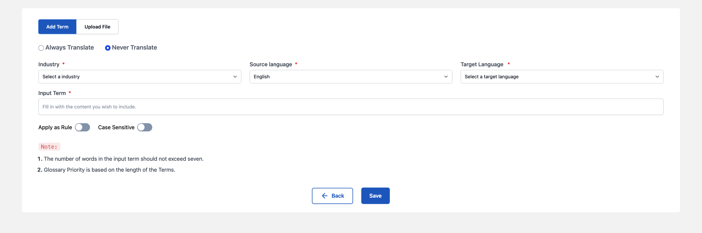
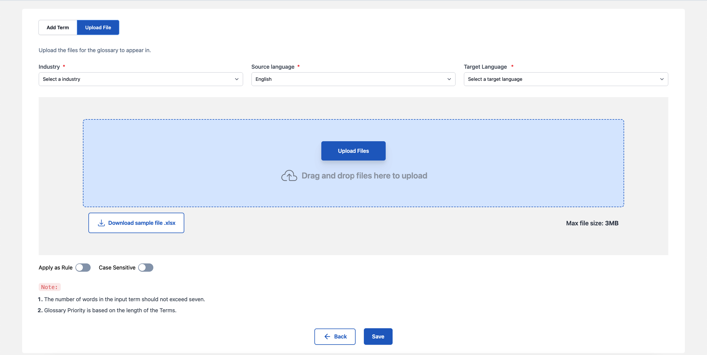

# Rules / Glossary

Glossaries are the definitions and meanings of specific sentences unique to your domain. In the translation process it will help translators to find those terms and apply correct translations. Which will eventually improve your translation speed & quality.

Rule is implementation of prefrential translation of specific set of words using Machine Translation as well as Translators.

## Types of Glossaries / Rules

1. Translate Term
2. Do not translate

## Translate Term

By using this option, client should mention the replaced term, which will get replaced in place of input term"

## Do not Translate

By using this option, the input term remains untranslated and remains the same.

## How to Add Glossary / Rule

### Step 1: Go to Translation Settings Tab

### 

### Step 2: Click on Manage Glossary / Rules

### 

### Step 2: Click on Add Glossary

### Add Term

i. Select the “Industry”, according to the order and terminology.

ii. Select "Source language".

iii. Select "Target language".

iv. “Input Term” - Input the term/word to be translated.

v. "Replaced Term" is the output / prefrential translation for the "input term" added. It helps to specify prefrential translation is required for specific terms.

vi. User can select "Apply as Rule" to implement prefrential translation for specific set of words using Machine Translation as well as Translators.

vii. User can select "Case Sensitive" option to consider the distinction between uppercase and lowercase letters when processing rules.

viii. Use “Save” option to store the terms in glossary.

### Upload Glossary

i. To understand how to upload the terms in bulk user can “Download Sample File”. Add the term, description, and the status of translation in “True/False”

ii. After the information is added in the file and saved, choose the “Industry”.

iii. Select "Source Language"

iv. Select "Target Language"

iv. Upload the file by simple “drag and drop” or selecting the local file destination.

v. User can select "Apply as Rule" to implement prefrential translation for specific set of words using Machine Translation as well as Translators.

vi. User can select "Case Sensitive" option to consider the distinction between uppercase and lowercase letters when processing rules.

vii. As soon as the file gets successfully uploaded select “Save” option.

## How to Generate Glossary

### Step 1: Go to Translation Settings Tab

### 

### Step 2: Click on Manage Glossary / Rules

### 

### Step 2: Click on Add Glossary

i. Add the “Industry”, select according to the order and terminology

ii. Select "Source language"

iii. Select "Target language'. User can select multiple target language.

v. In order to add the content for creating glossary user can upload file or can choose order.

vi. Use "Generate" option to generate glossary

